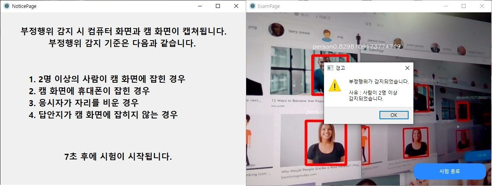

# :computer: Stop_Cheating
>2021년 1학기 오픈소스SW입문 Term Project : *OpenCV를 활용한 온라인 시험 컨닝 방지 시스템*  
<br/>

## :loudspeaker: 프로젝트 소개
비대면 시험 중 컨닝 문제를 해결하기 위해 웹캠에서 실시간으로 영상을 받아와 부정행위를 검출하는 시스템입니다.  
딥러닝 기반 프레임워크인 YOLO를 적용하여 Object Detection 과정을 통해 부정행위를 검출합니다.

## :wrench: Features
### 부정행위 검출
- 웹캠으로부터 입력을 받아 시스템이 부정행위 여부를 판별하여 알림메세지를 출력합니다  
부정행위로 판별되는 경우는 다음과 같습니다.
1.  2명 이상의 사람이 캠 화면에 잡힌 경우
   <br/>
2.  캠 화면에 휴대폰이 잡힌 경우
   <br/>
3.  응시자가 자리를 비운 경우
   <br/>
4. 답안지 혹은 시험지가 캠 화면에 잡히지 않는 경우
   <br/>


### 캠 및 화면 캡쳐 기능
- 시스템이 부정행위를 판별한 경우, 사용자의 컴퓨터 화면 및 웹캠 화면을 캡쳐하여 images 폴더에 저장합니다.

### 카카오톡 알림 기능
- 시스템이 부정행위를 판별한 경우, 카카오톡 메세지로 알림을 보냅니다.
<br/>


## :camera: Screenshot



## :books: Techs

  ### [OpenCV - Python](https://github.com/opencv/opencv)
  - 실시간 영상 처리 및 입출력을 위해서 OpenCV Python 라이브러리를 사용하였습니다.
  ### [Yolo v3](https://github.com/ultralytics/yolov3) 
  - 핵심 기능인 Object Detection의 정확도를 위해서 딥러닝 프레임워크인 Yolo v3을 채용하였습니다. 
  - 호환성 및 성능(속도, 정확도), 안정성을 고려하여 v3버전을 사용하였고, 커스텀 모델 학습을 통해 성능 향상 및 핵심 기능을 구현하였습니다.
  ### [PyQT5](https://pypi.org/project/PyQt5/) 
  - OpenCV 라이브러리와의 호환성을 고려하여 핵심 UI 구현 프레임워크로 PyQT5를 사용하였습니다.
  ### [Kakao API](https://developers.kakao.com/)
  - 부정행위 검출 시 카카오톡을 통한 알림 기능을 구현하기 위해 Kakao API를 사용하였습니다.

## :triangular_flag_on_post: 실행 방법
### :rotating_light:카메라가 있는 기기에서만 실행 가능합니다:rotating_light:
* COCO Pretrained Dataset을 이용한 테스트 방법  
[YOLO](https://pjreddie.com/darknet/yolo/) : 여기에서 원하는 버전의 weight 파일, cfg 파일, coco.names파일 다운로드 후 프로젝트 폴더에 추가   
  ```
  yolov3.weight  yolov3.cfg  coco.names
  ```
* Custom Dataset을 이용한 방법  
커스텀 학습을 통해 생성된 weight파일과 .cfg파일 프로젝트 폴더에 추가
  ```
  yolov3.weight  yolov3.cfg
  ```

## :two_men_holding_hands: Members

박지윤 [@PrimWILL](https://github.com/PrimWILL)  
옥명관 [@canonn11](https://github.com/canonn11)  
김동현 [@donghyun1208](https://github.com/donghyun1208)

----------------------------------------------------

## :memo: How to use COCO dataset

1. Download COCO dataset   
: You can download COCO dataset in [here](https://cocodataset.org/#download).
But data is so large, so I recommend to download it using this [shell script](https://gist.github.com/mkocabas/a6177fc00315403d31572e17700d7fd9). 

2. Download COCO to YOLO tool  
: After downloading COCO dataset, you have to convert COCO data to YOLO. 
You can convert it easy by using [cocotoyolo.jar](https://bitbucket.org/yymoto/coco-to-yolo/src/master/). However, the link is expired, so you can download tool in [here](https://github.com/winston1214/AICT/blob/master/yolov5/cocotoyolo.jar). 

3. Convert COCO to YOLO  
: Now we have to convert COCO to YOLO using `cocotoyolo.jar`. It's very easy.
`$ java -jar cocotoyolo.jar "json file path" "img path" "class" "save path"`. For example, 
```
$ java -jar cocotoyolo.jar "coco/annotations/instances_train2017.json" "/usr/home/madmax/coco/images/train2017/" "car,truck,bus" "coco/yolo"

$ java -jar cocotoyolo.jar "coco/annotations/instances_val2017.json" "/usr/home/madmax/coco/images/val2017/" "car,truck,bus" "coco/yolo"
```

## :wrench: How to install Yolo Mark
1. Download labeling tool.  
: If you want to use custom dataset, you should mark bounded boxes of the object in your custom image. There's [Yolo Mark](https://github.com/AlexeyAB/Yolo_mark) which is marking bounded boxes of objects in images for training Yolo v3 and v2.  

2. Execute yolo_mark.sln  
: After download Yolo Mark, please execute `yolo_mark.sln` in Yolo_mark folder. If you don't have MSVC, then please download [MSVC](https://visualstudio.microsoft.com/ko/downloads/) to open the sln file.  

3. Set preferences  
: There are something to change preferences. First, change build environment default into `Release/x64`. Open the project property pages. In `C/C++ -> General -> Additional Include Directories`, modify OpenCV path. You can download OpenCV in [here](https://opencv.org/releases/). Also, in `Linker -> General -> Additional Include Directories`, modify link path.  

4. Build project  
: Build yolo_mark project. If you set preferences properly, then it builds successfully.  

5. Execute yolo_mark.cmd  
: If you built project successfully, then execute `yolo_mark.cmd` in `Yolo_mark -> x64 -> Release` folder.  


## :hammer: How to make custom Yolo dataset  
1. Change working directory  
: First, you change your working directory into `Yolo_mark -> x64 -> Release -> data -> img`.  

2. Delete sample file.  
: If you use yolo_mark at first, then there are some sample files. Delete all the sample *.jpg and *.txt file.  

3. Put images  
: Put your images which you want to make custom Yolo dataset in this folder.  

4. Execute obj.names  
: Move to the parent directory. Then execute `obj.names` file. If you can't open this file, then change the name of extension; `names` -> `txt`.  

5. Modify obj.names  
: `obj.names` is a file which defines names of classes. Hence, please put the names of classes which you want to detect objects. If you change the extension in step 4, then change extension into original: `names`.  

6. Execute yolo_mark.cmd  
: Back to the parent directory. Then, execute `yolo_mark.cmd`.

7. Mark bounded boxes  
: Mark bounded boxes of the object in your custom image. You can see help using shortcut `h`.

<br/>

------------------------

## 자료 모음
* [YOLO](https://pjreddie.com/darknet/yolo/) : 여기에서 yolo 여러 버전의 모델과 weights를 다운받을 수 있음.  
* [You Only Look Once: Unified, Real-Time Object Detection](https://arxiv.org/pdf/1506.02640.pdf) : YOLO 창시자인 Josepth Redmon의 논문
* [YOLOv3: An Incremental Improvement](https://arxiv.org/pdf/1804.02767.pdf) : YOLO 창시자인 Joseph Redmon의 YOLOv3에 관한 논문

* [[YOLO] Python과 OpenCV를 이용한 실시간 객체 탐지 알고리즘 구현](https://deep-eye.tistory.com/6)
* [Python으로 OpenCV를 사용하여 YOLO Object detection](https://bong-sik.tistory.com/16)
* [[OpenCV Programming] 객체 추적2](https://dsbook.tistory.com/180?category=793748)
* [Yolov4-deepsort](https://github.com/theAIGuysCode/yolov4-deepsort/tree/9e745bfb3ea5e7c7505cb11a8e8654f5b1319ad9): Yolo v4와 Deep Sort를 결합
* [Object Detection and Tracking in 2020](https://blog.netcetera.com/object-detection-and-tracking-in-2020-f10fb6ff9af3): Object Detection과 Tracking에 관한 여러 알고리즘의 소개 및 비교
* [deep learning object detection](https://github.com/hoya012/deep_learning_object_detection): Object Detection의 연구 동향 및 논문 모음
* [YOLOv4 : Object detection의 최적의 속도와 정확도](https://keyog.tistory.com/31)
* [OpenCV - 32. 객체 추적을 위한 Tracking API](https://bkshin.tistory.com/entry/OpenCV-32-%EA%B0%9D%EC%B2%B4-%EC%B6%94%EC%A0%81%EC%9D%84-%EC%9C%84%ED%95%9C-Tracking-API)
* [OpenCV docs: Tracking API](https://docs.opencv.org/3.4/d9/df8/group__tracking.html) : OpenCV의 Tracking API에 관한 공식 문서
* [NMS (non-maximum-suppression)](https://dyndy.tistory.com/275): NMS에 대한 소개
* [You Only Look Twice — Multi-Scale Object Detection in Satellite Imagery With Convolutional Neural Networks (Part I)](https://medium.com/the-downlinq/you-only-look-twice-multi-scale-object-detection-in-satellite-imagery-with-convolutional-neural-38dad1cf7571) : YOLO에서 성능 향상을 통한 비행기 검출
* [HOYA012's RESEARCH BLOG](https://hoya012.github.io/contact/) : Object Detection Tutorials
* [[Object Tracking] 객체 탐지 및 추적 방법 (1)](https://eehoeskrap.tistory.com/90): Object tracking 기술 설명 및 주의점
* [객체 검출/물체 인식의 NMS보다 좋은 앙상블 방법, Weighted Boxes Fusion(WBF)](https://lv99.tistory.com/74?category=810681): Weighted Box Fusion(WBF)에 대한 소개
* [3부. Custom YOLO v3 모델 만들기](https://nero.devstory.co.kr/post/pj-too-real-03/)
* [다양한 YOLO 버전, 어떤 버전을 선택해야 할까](https://yong0810.tistory.com/30)
* [YOLO: Unified, Real-Time Object Detection](https://docs.google.com/presentation/d/1aeRvtKG21KHdD5lg6Hgyhx5rPq_ZOsGjG5rJ1HP7BbA/pub?start=false&loop=false&delayms=3000&slide=id.p): YOLO의 동작과정을 그림으로 한 눈에 알아보기 쉽게 정리되어 있음
* [[Open Source] YOLO v3 윈도우 버전 설치 및 튜토리얼 한방에 정리](https://studyingcoder.blogspot.com/2019/04/open-source-yolo-v3.html)
* [You Only Look Once — 다.. 단지 한 번만 보았을 뿐이라구!](https://medium.com/curg/you-only-look-once-%EB%8B%A4-%EB%8B%A8%EC%A7%80-%ED%95%9C-%EB%B2%88%EB%A7%8C-%EB%B3%B4%EC%95%98%EC%9D%84-%EB%BF%90%EC%9D%B4%EB%9D%BC%EA%B5%AC-bddc8e6238e2): YOLO의 개념과 네트워크 디자인 소개
* [YOLO v4 리뷰 : Optimal Speed and Accuracy of Object Detection](https://ropiens.tistory.com/33)
* [[ML] Object Detection 기초 개념과 성능 측정 방법](https://techblog-history-younghunjo1.tistory.com/178?category=863123)
* [[9] darknet(YOLOv3) 폴더 및 파일에 대한 간단한 분석](https://developer-thislee.tistory.com/17?category=818795) 
* [[10] Yolo_mark labeling(라벨링) & 경로 설정](https://developer-thislee.tistory.com/18?category=818795)
* [[11] YOLOv3 데이터(이미지) 학습하기](https://developer-thislee.tistory.com/19?category=818795)
* [YOLO v3 윈도우 설치](https://ctkim.tistory.com/81)
* [Window - YOLO Maker를 이용한 Custom 학습 및 검출](https://ctkim.tistory.com/82)
* [YOLOv5 - training & test](https://bigdata-analyst.tistory.com/195)